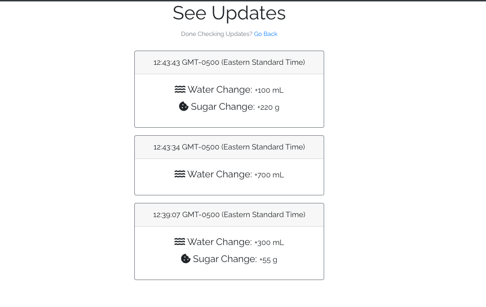

# Essential

Build a habit by only needing keeping track of the two most impactful nutrients, water and sugar, and set daily goals and restrictions.

Lead a healthier lifestyle in the simplest way possible and before you know it, Essential will be an essential part of your life.

<a href="https://essentialtracker.herokuapp.com/">Start today!</a>

<h2>How to use:</h2>
This web application is built simple to use. 

<h4>Registration</h4>
Registration is basic and easy and the only extra thing you need to do is set your daily water and sugar goals. Don't worry, you can always change them at any point! 

<h4>Tracking:</h4>
To choose how much to increment/decrement by, either click a button to use a preset value or set your own custom value in the input box.
Then, all you need to do is click + or -, depending on what you want to do. Changes are immediately reflected and a graphical representation is given using how muc percent of the goal or limit has been reached. Thats it! No flashy effects or an overwhelmingly and intimidatingly amount of features, just the essentials.  

 

<h4>Checking Updates</h4>
Never lose track of what you inputted. You can track your daily updates by clicking the updates tab, which will outline your activity.

 

<h4>Checking Previous Days</h4>
Similar to the updates, you can also track your previous days. By clicking on the previous days link on the navbar, you will first be presented with a list of previously tracked days. By clicking on a specific day, you will be presented with your stats for that day.

 

